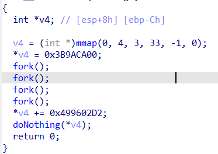
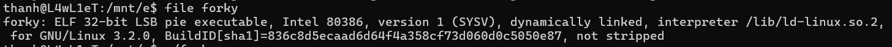

# patchme.py
-- Nếu user_pw = `ak98-=90adfjhgj321sleuth9000` thì thực hiện decrypt flag đã bị encrypt  


-- Nhập password -> decrypt flag thành công 


# Safe Opener
-- Chương trình yêu cầu nhập password và encode thành chuỗi base64. Nếu sau khi encode bằng với chuỗi `cGwzYXMzX2wzdF9tM18xbnQwX3RoM19zYWYz` thì password đúng. 


-- Để tìm được password trước khi encode base64 -> Decode base64 chuỗi `cGwzYXMzX2wzdF9tM18xbnQwX3RoM19zYWYz`


# bloat
-- Dễ dàng có thể nhìn thấy hàm arg132 có chức năng đọc nội dung file flag.txt.enc. Tiếp theo, gọi các hàm lần lượt : arg232, arg133, arg112 và arg111.  


-- Sử dụng print để hiểu các chức năng của chương trình. Từ output suy ra password nhập vào được so sánh với chuỗi `happychance`


# Bbbbloat
-- Dòng 23, hàm scanf nhận input và lưu vào địa chỉ của local_48. Tiếp theo, so sánh nội dung tại địa chỉ local_48 với `0x86187`. Nếu thỏa điều kiện thì hàm fputs in ra chuỗi nào đó (có vẻ như là flag)


-- Chuyển sang dạng thập phân để gửi input 


# unpackme
-- Check thông tin file : no section header -> Có vẻ như phần này đã bị xóa để giảm kích thước file hoặc lí do bảo mật nào đó ?


-- Phân tích các chuỗi : `strings unpackme-upx` thì tìm được đoạn thông tin "File này đã bị pack bằng UPX executable packer"


-- Unpack file : `upx -d unpackme-upx` -> Check lại thông tin -> Unpack thành công


-- Dòng 22, hàm scanf nhận input và lưu vào địa chỉ của iStack_44. Tiếp theo, so sánh nội dung tại địa chỉ iStack_44 với `0xb83cb`. Nếu thỏa điều kiện thì hàm fputs in ra chuỗi nào đó (có vẻ như là flag)


-- Chuyển sang dạng thập phân để gửi input 


# Picker I
-- Chương trình yêu cầu nhập chuỗi `getRandomNumber` để nhận một giá trị ngẫu nhiên. Dòng 165, hàm eval thực thi biểu thức ( user_input kết hợp với `()` ) tức là khi nhập getRandomNumber thì biểu thức là `getRandomNumber()` tương đương với việc gọi hàm getRandomNumber


-- Biết rằng trong chương trình còn có hàm win để đọc flag -> Sẽ ra sao nếu user_input là `win` ?


-- Gửi input -> Nhận được output là một dãy các phần tử ở dạng hex


-- Chuyển các giá trị hex sang kí tự ascii -> Flag


# Picker II
-- Ở phần II, có thêm hàm filter để lọc chuỗi `win` trong user_input. Vậy ngoài hàm win ra thì còn hàm nào có thể giúp đọc flag không ?


-- Thử sử dụng hàm print -> Output là một dòng rỗng -> Có thể sử dụng hàm print để hiển thị flag


-- Dòng 78, `open('flag.txt', 'r').read()` trả về nội dung của flag 


-- Lệnh hoàn chỉnh để đọc flag : `print(open('flag.txt', 'r').read())`. Tuy nhiên, 2 kí tự cuối cùng trong hàm eval là `()`. Thử `print(1)()` -> Output vẫn hiển thị giá trị 1 -> nếu có `()` ở cuối thì hàm eval thì vẫn xử lý


-- Gửi input lên server -> Nhận flag 


# Keygenme
-- Chương trình yêu cầu nhập lisence key. Hàm fgets đọc tối đa 37 kí tự (bao gồm cả kí tự kết thúc chuỗi). Sau đó, hàm sub_1209 nhận đối số là chuỗi vừa nhập và in ra chuỗi thông báo key hợp lệ khi thỏa điều kiện -> Có vẻ như hàm này dùng để kiểm tra giá trị key nhập vào. 


-- Đi vào hàm sub_1209, dòng 16 và 17 copy phần đầu và cuối flag vào s và v8. Dòng 23 đến 27 chuyển các chuỗi trong v8 thành chuỗi dạng hexa để ghép vào chuỗi s. Dòng 29 đến 33 cũng tương tự với v11


-- Dòng 34 đến 44 thực hiện gán giá trị cho v11 từ index 32 đến 67


-- Tiếp theo, câu lệnh if kiểm tra độ dài của a1 (s). Nếu a1 không phải 36 kí tự thì trả về 0. Sau đó, kiểm tra các kí tự của a1 có bằng các kí tự từ index 32 đến 67 trong v1 hay không 


-- Debug đến đoạn strlen -> In ra chuỗi v1 -> Flag 


# not crypto
-- Chương trình hiển thị thông báo và chờ user nhập input vào. Sau khi gửi input thì hiển thị thông báo "Nope, come back later".


-- Phân tích : dòng 360 thực hiện hiển thị chuỗi "Nope, come back later" -> Cỏ vẻ như đây chính xác là dòng hiển thị thông báo sau khi gửi input. Dòng 365 hiển thị thông báo "Yep, that's it!". Tôi đoán khi nhập đúng input thì sẽ hiển thị chuỗi này. Mà việc thực thi đoạn mã trong if phụ thuộc vào v18 hay nói cách khác là kết quả trả về của hàm memcmp -> Suy đoán :  v117 hoặc ptr chứa input nhập vào


-- Tìm kiếm các vị trí xuất hiện ptr thì tìm thấy được tại dòng 126 thực hiện đọc 0x40 (64) byte và lưu vào địa chỉ mà ptr trỏ tới -> Bây giờ, cần xem nội dung của v117 (tham số thứ nhất trong hàm memcmp)


-- Đặt `break memcmp@plt` và chạy chương trình. Check tham số thứ nhất : `x/s $rdi` -> Tìm được flag


# gogo
-- Chương trình yêu cầu user nhập password vào. Sau khi nhập input thì gửi thông báo "Try again!" -> Có thể đây là thông báo khi nhập sai password


-- Phân tích hàm main_checkPassword : dòng 9, 10 kiểm tra nếu độ dài của input < 32 thì thoát chương trình. Sau đó, hàm qmemcpy sao chép chuỗi "861836f13e3d627dfa375bdb8389214e" vào key. Dòng 20 kiểm tra kết quả sau khi xor từng kí tự của input với key có bằng với các kí tự trong v4 hay không


--  Sử dụng ghidra để xác định vị trí của v4 và leak các kí tự ra. Đặt breakpoint tại địa chỉ 0x080d4b28 và chạy chương trình


-- Eax đang có giá trị 0x0 -> Kí tự đầu tiên ở địa chỉ esp+0x24


-- Hiển thị 32 byte tại esp+0x24 ->  v4 : `4a53475d414503545d025a0a5357450d05005d555410010e4155574b45504601`. Sau đó, lấy 32 byte này xor với key sẽ ra 32 byte input cần phải nhập 


-- Kết quả sau khi xor : `reverseengineericanbarelyforward`


-- Sau khi gửi password, chương trình yêu cầu nhập key sau khi unhash -> Tìm kiếm thì phát hiện ra trong hàm main_ambush có một hàm crypto_md5_Sum -> Tôi đoán luôn là sử dụng thuật toán md5. Chuối mã hóa md5 thành 861836f13e3d627dfa375bdb8389214e là `goldfish`. Vì đang thử trên local nên đây là flag giả


-- Kết nối đến server để gửi password và key trước khi hash -> Nhận được flag


# reverse_cipher
-- Phân tích : dòng 23 đến 28 thực hiện đọc 24 byte từ tệp "flag.txt" vào mảng flag. Nếu không đọc được byte nào (len < 1) thì thoát chương trình. Vòng lặp thứ nhất duyệt qua các ký tự từ vị trí 0 đến 7 trong mảng flag và ghi vào tệp "rev_this". Vòng lặp thứ hai duyệt các kí tự còn lại của flag, nếu vị trí j AND với 1 bằng 0 thì kí tự sẽ được tăng thêm 5 đơn vị và nếu kết quả phép AND khác bằng 0 thì giảm 2 đơn vị -> Giảm 5 đơn vị các kí tự tại vị trí chẵn và tăng 2 đơn vị các kí tự tại vị trí lẻ trong rev_this thì nhận được flag (áp dụng với index từ 8 đến 22)


-- Chạy chương trình : [reverse_cipher.py](./script/reverse_cipher.py) -> Tìm được flag 


# Forky
-- Mục tiêu của bài này là tìm ra giá trị của v4 khi truyền vào hàm doNothing. Chương trình gọi ra 4 hàm fork để tạo các tiến trình con. Ban đầu, *v4 là 1000000000. Sau đó, mỗi tiến trình con sẽ thêm 1234567890 vào giá trị này.



-- Vì có 4 hàm fork được gọi nên sau lần gọi fork() thứ tư có thể tồn tại 16 tiến trình nếu tất cả hàm fork đều gọi thành công. Minh họa :

```
			        |
			        |
			        |________________________________________________
Fork đầu tiên 		|						                        |
			        |						                        |
			        |						                        |
Fork thứ hai		|____________________		                    |____________________
			        |                   |  		                    |                   |
			        |                   |                           |                   |
Fork thứ ba		    |________	        |________                   |________           |________
                    |       |           |       |                   |       |           |       |
                    |       |           |       |                   |       |           |       |
                    |       |           |       |                   |       |           |       |
Fork thứ tư         |____   |____       |____   |____               |____   |_____      |____   |____
                    |   |   |   |       |   |   |   |               |   |   |    |      |   |   |   |
                    |   |   |   |       |   |   |   |               |   |   |    |      |   |   |   |
                    |   |   |   |       |   |   |   |               |   |   |    |      |   |   |   |               			        
```

-- Vì đây là file dành cho kiến trúc x86 32 bit nên giá trị tại địa chỉ mà v4 trỏ tới có kích thước tối đa 32 bit



-- Chạy chương trình : [forky.py](./script/forky.py) -> Tính ra giá trị là `-721750240`  -> Flag : `picoCTF{-721750240}`


# OTP Implementation
-- Phân tích : `strncpy(dest, argv[1], 100uLL);` thực hiện sao chép 100 byte từ argv[1] vào dest. `dest[100] = 0;` gán kí tự cuối cùng bằng ký tự null. Vòng lặp for thứ nhất sử dụng hàm valid_char kiểm tra xem ký tự có hợp lệ không. Sau đó, mã hóa chuỗi dest thành s1. Vòng lặp for thứ hai tăng thêm 97 đơn vị với mỗi kí tự sau khi mã hóa. Cuối cùng, kiểm tra có đúng 100 kí tự đã được mã hóa hay không và kiểm tra s1 có khớp với chuỗi "adpjkoadapekldmpbjhjhbaghlfldbhjdalgnbeedheenfoeddabpmdnliokcahomdphbcleipfgibjdcgmjcmadaomiakpdjcni" hay không


-- Từ hàm valid_char -> Phạm vi argv[1] : hoặc [48, 57] hoặc [97, 102] tức là từ 0 đến 9 hoặc từ a đến f


-- Đặt `break strncmp@plt` và chạy chương trình với đối số có kích thước 100 byte. Xem tham số thứ nhất (rdi) thì đúng là chuỗi được so với s1. Xem tiếp tham số thứ hai (rsi) là chuỗi sau khi mã hóa. Tiếp theo, thực hiện brute force để tìm ra các kí tự trước khi được mã hóa


-- Sử dụng lệnh `gdb -x otp.py ./otp` để chạy chương trình [otp.py](./script/otp.py) -> Tìm được key


-- Sau đó, xor key với chuỗi hex trong flag.txt -> Flag

