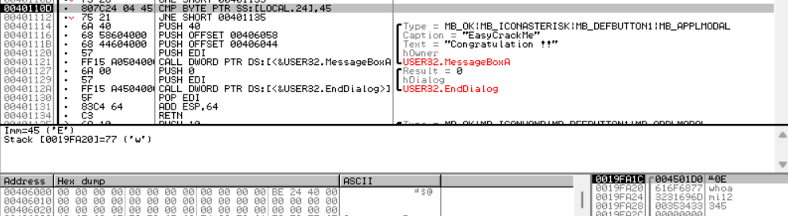
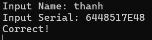

# Easy Crack
-- Chương trình yêu cầu nhập password -> Hiển thị message box có nội dung là "Incorrect Password" -> Có thể thông báo này xuất hiện khi nhập sai password

-- Tìm vị trí chuỗi "Incorrect Password" 

-- Kiểm tra các nơi tham chiếu đến địa chỉ 0x00401135 và tìm ra 4 vị trí có thể dẫn đến Incorrect Password : 0x004010B5, 0x004010CD, 0x0040110B, và 0x00401112

-- Đi tới vị trí 0x004010B5 thì tìm thấy trước lệnh JNE là lệnh CMP đang so sánh giá trị nào đó với kí tự 'a'. Đặt breakpoint và chạy chương trình. Tại địa chỉ 0x004010B0, thực hiện so sánh kí tự 'a'  với kí tự 'h' nằm trong stack. Mà trong stack hiện tại đang chứa input nhập vào -> Chương trình đang so sánh kí tự thứ 2 với 'a'. Nếu không bằng nhau thì nhảy tới vị trí 0x00401135. 

-- Qua tới lệnh JNE, thay đổi zero flag = 1 để câu lệnh JNE không thực hiện nhảy. Các lệnh JNE sau tương tự

-- Tại địa chỉ 0x004010C3, lệnh call đang gọi hàm nào đó tại địa chỉ 0x00401150. Quan sát stack, đối số thứ nhất "oami12345", đối số thứ hai là "5y" và đối số thứ ba là 2 -> Có vẻ như hàm này so sánh kí tự thứ 3,4 trong input với "5y"

-- Tại 0x004010D1 và 0x004010D6 : thực hiện gán địa chỉ chứa chuỗi "R3versing" vào ESI và địa chỉ tại vị trí thứ 5 input vào EAX . Sau đó, vòng lặp so sánh từng phần tử có bằng nhau hay không. Nếu không thì nhảy đến 0x00401102

-- Đi tiếp tới vị trí lệnh JNE, zero flag = 0 nên sẽ nhảy sang 0x00401135 và Incorrect Password -> Từ vị trí thứ 5 đến cuối phải bằng chuỗi "R3versing"

-- So sánh kí tự thứ nhất với 'E'

-- Khi thỏa hết các điều kiện thì hiển thị thông báo "Congratulation !!"

-- Từ các điều kiện có thể kết luận rằng : Password = `Ea5yR3versing`

# Easy Keygen
-- Chương trình yêu cầu nhập name và serial. Sau khi nhập ngẫu nhiên dãy số vào serial thì hiển thị thông báo "Wrong". Lúc này, có thể tiếp cận theo 3 hướng : thông báo "Wrong" hoặc "Input Serial" hoặc "Input Name"

-- Tìm chuỗi "Input Serial" và đặt breakpoint tại địa chỉ 0x004010C1

-- Sau khi thực hiện lệnh `CALL 0x004011B9` thì hiển thị chuỗi "Input Serial" để yêu cầu nhập 

-- Tại địa chỉ 0x004010E6 lệnh LEA gán giá trị là địa chỉ 0x0019FE0C trong stack chứa nội dung Serial mà user nhập vào EAX. Sau đó, thực hiện vòng lặp để kiểm tra các điều kiện. Lệnh MOV đầu tiên trong vòng lặp gán 1 byte mà EAX trỏ tới của input vào thanh ghi DL. Tiếp theo, lệnh CMP so sánh giá trị trong thanh ghi DL tức là 1 trong input với giá trị tại địa chỉ mà ESI đang trỏ tới có giá trị là 6. Tiếp tục, vì hiện tại 2 giá trị không bằng nhau nên lệnh JNE thực hiện nhảy tới 0x0040110E và đi tiếp thì nhận được thông báo "Wrong" -> Vòng lặp này đang so sánh chuỗi "6448517E48" và "1234567890"

-- Chạy lại chương trình và gửi lại số Serial 

